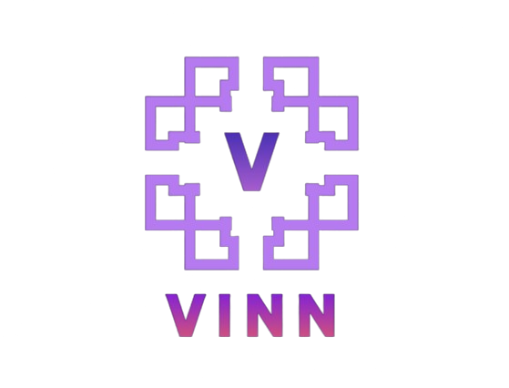

<a name="readme-top">

<br/>

<br />
<div align="center">
  <a href="https://github.com/JOHNARVINTUM/">
  <!-- TODO: If you want to add logo or banner you can add it here -->
    
  </a>
<!-- TODO: Change Title to the name of the title of your Project -->
  <h3 align="center">WD-Finals</h3>
</div>
<!-- TODO: Make a short description -->
<div align="center">
This projects demonstrate my skills on creating a website especially for Portfolio purposes. This projects also has the compiled previous projects.
</div>
</div>

<br />

<!-- TODO: Change the zyx-0314 into your github username  -->
<!-- TODO: Change the WD-Template-Project into the same name of your folder -->


---

<br />
<br />

<!-- TODO: If you want to add more layers for your readme -->
<details>
  <summary>Table of Contents</summary>
  <ol>
    <li>
      <a href="#overview">Overview</a>
      <ol>
        <li>
          <a href="#key-components">Key Components</a>
        </li>
        <li>
          <a href="#technology">Technology</a>
        </li>
      </ol>
    </li>
    <li>
      <a href="#rule,-practices-and-principles">Rules, Practices and Principles</a>
    </li>
    <li>
      <a href="#resources">Resources</a>
    </li>
  </ol>
</details>

---

## Overview

<!-- TODO: To be changed -->
<!-- The following are just sample -->

Purpose and Overview
The primary objective of this project is to create a professional portfolio website that showcases the skills, projects, and knowledge I have acquired from May to the present. This website will serve as a digital resume and portfolio, demonstrating my growth and competencies in various areas. Additionally, this project will provide a versatile template for a portfolio website that can be updated and used for future purposes.

Features

1. Home    - This is considered as landing page whenever someone opens my Website.
2. About   - In this page it provides information about myself including my goals and skills.
3. Project - In this page it provides the list of my previous projects including its repositories.
4. Skills  - In this page it provides the skills that I have and it also indicate where I am really good at.
5. Contact - In this page it provides my contact information whenever someone wants to contact me.

Interactions

1. Headers and footers are all working and Interactable.
- Github logo is used to direct the user to My Github account
- Facebook Logo is used to direct the user to my Facebook acoount
- Instagram logo is ued to direct the user to my Instagram account.
- Home button is used to go direct at the Home page/ Landing page.
- About button is used to go direct at the About page.
- Project button is used to go direct at the Project page.
- Skills button is used to go direct at Skills page.
- Contact button is used to go direct at Contact page.
2. Gallery Carousel at About page is also working, it has button to switch the picture to left or right, but also it is timed to switch.
3. In the porject area you need to hover your mouse to see the button to go to my past work or go directly to the repositoriy.

### Key Components
<!-- TODO: List of Key Components -->
<!-- The following are just sample -->
- MultiPage Website
- Dynamic Designs
- Static Designs
- JavaScript
- Href Links

### Technology
<!-- TODO: List of Technology Used -->


## Rules, Practices and Principles
1. Always use `WD-` in the front of the Title of the Project for the Subject followed by your custom naming.
2. Do not rename any .html files; always use `index.html` as the filename.
3. Place Files in their respective folders.
4. All file naming are in camel case.
   - Camel case is naming format where there is no white space in separation of each words, the first word is in all lower case while the succeding words first letter are in upper followed by lower cased letters.
   - ex.: buttonAnimatedStyle.css
5. Use only `External CSS`.
6. Renaming of Pages folder names are a must, and relates to what it is doing or data it holding.
7. File Structure to follow below.

```
WD-ProjectName
└─ assets
|   └─ css
|   |   └─ style.css
|   └─ img
|   |   └─ fileWith.jpeg/.jpg/.webp/.png
|   └─ js
|       └─ script.js
└─ pages
|  └─ pageName
|     └─ assets
|     |  └─ css
|     |  |  └─ style.css
|     |  └─ img
|     |  |  └─ fileWith.jpeg/.jpg/.webp/.png
|     |  └─ js
|     |     └─ script.js
|     └─ index.html
└─ index.html
└─ readme.md
```


## Wakatime

### Coding Activity

<a href="https://wakatime.com"></a>

### Languages

<a href="https://wakatime.com"></a>

## Resources

<!-- TODO: Add References -->
| Title | Purpose | Link |
|-|-|-|
| zyx-0314  | WD-Template-Project | https://github.com/zyx-0314/WD-Template-Project.git |
| Bootstrap | For Embedded code and Java | https://getbootstrap.com/docs/5.3/about/overview/#team |
| Pinterest | For Ideas and Pics |  https://github.com/zyx-0314/WD-Template-Project.git
| W3School | For HTML And CSS Guide | https://www.w3schools.com/html/default.asp |


